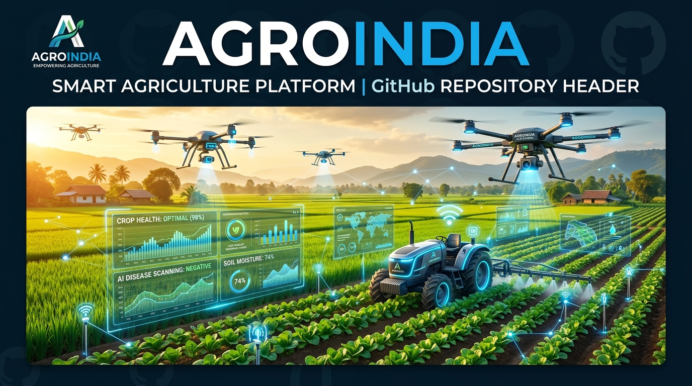
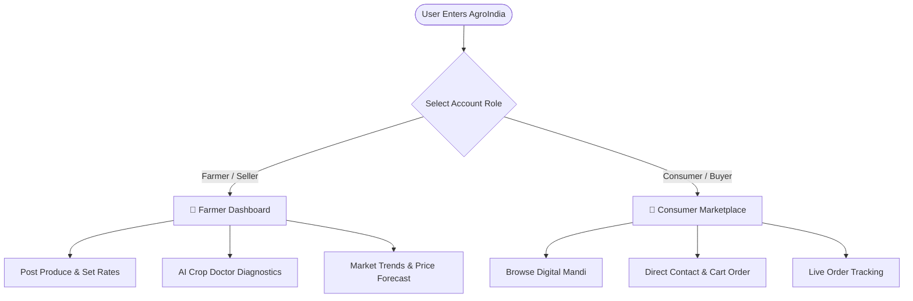

<div align="center">

# 🌾 AgroIndia — Smart Agriculture & Kisan Platform

[](https://github.com/)

<p align="center">
  <strong>Empowering Indian Agriculture with AI Disease Detection, Live Digital Mandi, Geospatial Mapping, and Market Intelligence.</strong>
</p>

<p align="center">
  
  
  
  
  
  
</p>

<p align="center">
  <a href="#-key-features">Key Features</a> •
  <a href="#-project-architecture">Architecture</a> •
  <a href="#-tech-stack">Tech Stack</a> •
  <a href="#-getting-started">Getting Started</a> •
  <a href="#-api-documentation">API Endpoints</a> •
  <a href="#-roadmap">Roadmap</a>
</p>

---

</div>

## 📌 Overview

**AgroIndia** is an all-in-one AgriTech platform designed to bridge the digital divide for Indian farmers. It eliminates exploitative intermediaries by providing a **zero-commission Digital Mandi**, empowers farmers with **Deep Learning AI crop disease diagnostics**, and delivers actionable market insights via **geospatial GIS mapping** and **predictive price analytics**.

---

## ✨ Key Features

| Feature | Description |
| :--- | :--- |
| 🛒 **Digital Mandi (Marketplace)** | Direct Farmer-to-Consumer / B2B marketplace with live crop listings, price per kg, direct seller contacts, interactive cart, and instant order placement. |
| 🔬 **AI Crop Disease Doctor** | Deep Learning visual diagnosis system where farmers can upload or drag-and-drop crop leaf photos to detect diseases (e.g., *Early Blight*) with confidence scores and chemical/organic remedies. |
| 🗺️ **Live Mandi & Farm Locator** | Interactive Leaflet.js map pinpointing nearby APMC Mandis, Cold Storage facilities, and verified registered agricultural farms. |
| 📈 **Market Intelligence & Price Estimator** | Chart.js price trend charts, AI-driven rate forecast based on regional weather signals, and an interactive Market Price Estimator for major crops (Wheat, Rice, Onion, Potato, Cotton). |
| 🌦️ **Live Weather Integration** | Real-time atmospheric forecasting and agricultural advisory built directly into the dashboard. |
| 🎙️ **Voice Assistant Integration** | Voice-activated navigation and smart assistant for simplified, hands-free operation in the field. |
| 🌐 **Bilingual Support (English & हिंदी)** | Seamless one-click English $\leftrightarrow$ Hindi localization for accessibility across diverse user demographics. |
| 👥 **Role-Based Auth & Tracking** | Distinct Farmer (Sell Produce) vs Consumer (Shop & Track Orders) workflows with secure SHA-256 hashed authentication and SQLite persistence. |

---

## 🛠️ Tech Stack

### **Frontend**
- **Core:** HTML5 (Semantic), Vanilla JavaScript (ES6+ Modules & State Management)
- **Styling:** Modern CSS3 (Glassmorphism, CSS Grid/Flexbox, Keyframe Animations)
- **Icons & Typography:** FontAwesome 6, Google Fonts (*Poppins*)
- **Mapping & Data Viz:** Leaflet.js (GIS Map), Chart.js (Analytics & Predictions)

### **Backend**
- **Framework:** Python Flask with Flask-CORS
- **Database:** SQLite3 (`users.db`) with relational schemas for users and dynamic marketplace products
- **Security:** SHA-256 password hashing & secure parameterized SQL queries

---

## 📂 Project Structure

```bash
finalproject/
├── assets/
│   └── banner.jpg          # Repository header & branding banner
├── app.py                  # Flask backend REST API & server
├── index.html              # Single Page Application (Frontend UI & Scripts)
├── requirements.txt        # Python package dependencies
├── users.db                # SQLite database (Users & Products)
└── README.md               # Project documentation
```

---

## 🚀 Getting Started

Follow these steps to set up and run the project locally on your machine:

### 1️⃣ Prerequisites
- **Python 3.8+** installed ([Download Python](https://www.python.org/downloads/))
- **Git** installed on your system

### 2️⃣ Clone the Repository
```bash
git clone https://github.com/your-username/agro-india.git
cd agro-india
```

### 3️⃣ Create a Virtual Environment (Optional but Recommended)
```bash
# Windows
python -m venv venv
venv\Scripts\activate

# macOS/Linux
python3 -m venv venv
source venv/bin/activate
```

### 4️⃣ Install Dependencies
```bash
pip install -r requirements.txt
```

### 5️⃣ Run the Application
```bash
python app.py
```

### 6️⃣ Access in Browser
Once running, navigate to:
```
http://127.0.0.1:5000/
```

---

## 🔌 API Documentation

| Method | Endpoint | Description | Request Body / Params |
| :--- | :--- | :--- | :--- |
| `GET` | `/` | Serves the main web application UI | None |
| `POST` | `/register` | Registers a new user account | `{ "email", "password", "full_name" }` |
| `POST` | `/login` | Authenticates user credentials | `{ "email", "password" }` |
| `GET` | `/products` | Retrieves all active crop listings | None |
| `POST` | `/add_product` | Adds a new product to Digital Mandi | `{ "name", "priceText", "priceNum", "desc", "img", "seller" }` |
| `DELETE` | `/delete_product/<id>` | Removes a product listing by ID | URL parameter `id` |

---

## 🎯 Target Users & Roles



---

## 🔮 Future Roadmap

- [ ] **IoT Sensor Integration:** Real-time soil moisture and NPK sensor telemetry sync.
- [ ] **Regional Language Expansion:** Support for Punjabi, Marathi, Telugu, Tamil, and Bengali.
- [ ] **Payment Gateway:** Direct UPI / Netbanking integration (Razorpay / Stripe).
- [ ] **Satellite NDVI Scanning:** Multispectral vegetation health indexing using open satellite data.
- [ ] **Automated SMS & WhatsApp Alerts:** Daily mandi rates delivered via WhatsApp bot.

---

## 🤝 Contributing

Contributions, issues, and feature requests are welcome!

1. Fork the Project
2. Create your Feature Branch (`git checkout -b feature/AmazingFeature`)
3. Commit your Changes (`git commit -m 'Add some AmazingFeature'`)
4. Push to the Branch (`git push origin feature/AmazingFeature`)
5. Open a Pull Request

---

## 📄 License

This project is licensed under the **MIT License** - see the [LICENSE](LICENSE) file for details.

---

<div align="center">
  <sub>Built with ❤️ for Indian Agriculture and Farmers 🇮🇳</sub>
</div>
